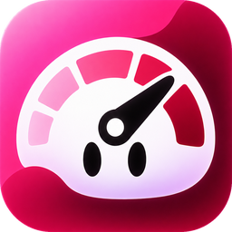

# BB Plugins by Kapustin

**Tools for focused work in [bb](https://getbb.app).**

14 independent plugins for planning, agent workflows and a workspace that fits how you work. By **Dmitrii Kapustin**.

[](https://getbb.app)
[](https://www.npmjs.com/package/@get-bb/plugin-sdk)
[](.bb/plugins.json)
[](LICENSE)

[Browse plugins](#plugins) · [Install](#install) · [Choose a pack](#choose-a-pack) · [Develop](#develop)

## Plugins

| | Plugin | Description |
| --- | --- | --- |
|  | [Agent Roles](plugins/agent-roles/README.md) | Create reusable specialist profiles and start focused agent work with your configured providers. |
|  | [Autopilots](plugins/automation-groups/README.md) | Organize scheduled work into folders and control groups together. |
|  | [Goals](plugins/goals/README.md) | Keep your personal priorities available when you ask an agent to evaluate an idea or plan. |
|  | [Apple Style Tasks](plugins/my-tasks/README.md) | Plan personal work with sections, nested steps and optional agent assistance. |
|  | [Role Picker](plugins/role-picker/README.md) | Choose a specialist in the composer and continue in the same conversation. |
|  | [Uptime](plugins/uptime/README.md) | Monitor website availability and response times from your BB server. |
|  | [Usage Limits](plugins/usage-limits/README.md) | See provider quota windows and reset times without leaving your work. |
|  | [Fast Archive](plugins/fast-archive/README.md) | Archive a thread directly from its header, with BB’s normal restore behavior. |
|  | [Visual Workflows](plugins/visual-workflows/README.md) | Design visual agent workflows with independent step profiles and inspect every run. |
|  | [Jev x bb](plugins/jev-bb/README.md) | Opt-in Eco Mode for provider-independent, Jev-assisted workspace context selection. |
|  | [Usage Bar](plugins/usage-bar/README.md) | Keep provider quotas and reset times visible above the sidebar footer. |
|  | [Sidebar Subtitles](plugins/sidebar-subtitles/README.md) | Organize sidebar destinations with editable section headings and explicit save, cancel and delete controls. |
|  | [Fast Split](plugins/fast-split/README.md) | Open a neighboring New thread pane with one click in the sidebar footer. |
|  | [Lock Area](plugins/lock-area/README.md) | Use native pane locking, or initialize a tested enhancement with backup and restore. |

## Install

Every plugin is its own package, settings store and release tag. See its README for setup and limits.

### From a local checkout

```sh
bb plugin install ./plugins/my-tasks
```

### From a versioned release

    bb plugin install 'git:https://github.com/dmitriikapustin/bb-plugins-by-kapustin.git@^0.3.0' --plugin my-tasks --tag-prefix my-tasks/

Apple Style Tasks keeps the existing **my-tasks** ID so upgrades preserve settings and data. Other plugins currently use version **0.1.0** with their own NAME/ tag prefix.

## Choose a pack

| Essentials · 8 plugins | Agents · 4 plugins | Operations · 2 plugins |
| --- | --- | --- |
| Personal tasks, goals, usage and workspace controls. | Specialist roles, visual workflows and Jev Eco Mode. | Scheduled work and website monitoring. |
| `essentials` | `agents` | `operations` |

The pack helper prints the exact install commands before executing anything.

    node scripts/install-pack.mjs essentials
    node scripts/install-pack.mjs agents
    node scripts/install-pack.mjs operations
    node scripts/install-pack.mjs all

Add `--apply` to run the printed commands with BB’s installation confirmations.

## How they fit together

**Agent Roles** owns reusable specialists. **Role Picker** includes its own presets and can also use the Agent Roles library. **Visual Workflows** owns local step profiles, graphs and runs; it can import independent copies from Agent Roles. Every one of these works on its own.

**Usage Bar** puts quotas above the footer. **Usage Limits** opens the detailed quota view from a footer shortcut. Both obtain their own data through BB and can be installed separately.

**Sidebar Subtitles**, **Fast Split** and **Fast Archive** keep navigation close at hand. **Lock Area** uses compatible native locks or offers an explicit, version-checked native initializer with backup and restore.

**Jev x bb** adds per-thread Eco Mode for source-context selection with your own Typesafe key. It sends requested non-sensitive file ranges to Typesafe when enabled. It does not rewrite your provider's history; character counters are not token or billing measurements.

## Screenshots

Each plugin README includes screenshots of its interface and setup instructions.
Captures use isolated demonstration data; quota and automation examples are illustrative.
See the [capture notes](marketplace/SCREENSHOTS.md).

## Develop

Node 22.19+ and the BB CLI are required. Packages have independent public npm lockfiles and no sibling workspace dependencies.

    npm run deps
    npm run verify
    node scripts/run.mjs check role-picker

Build before reloading a local development installation. Confirm its source path first. Keep plugin IDs stable and never install from disposable source directories.

MIT · **Dmitrii Kapustin** · [GitHub](https://github.com/dmitriikapustin)

Independent community plugins. BB, Apple and Typesafe names identify compatibility; this collection is not affiliated with those companies.
