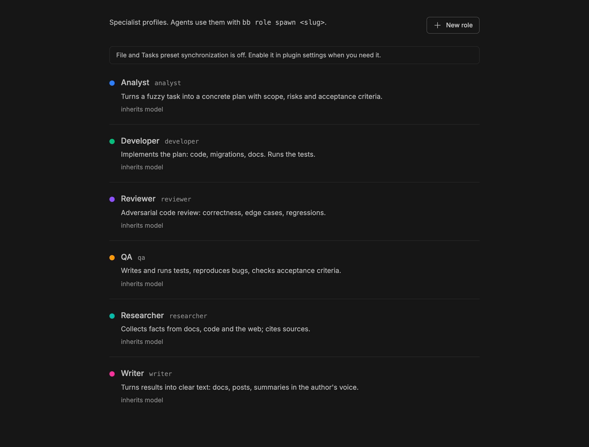

# Agent Roles

[](package.json)
[](https://getbb.app)
[](LICENSE)

Define reusable specialists with clear instructions and execution preferences. Start focused work, or share profiles with optional companion plugins.

[Quick start](#quick-start) · [Install](#install) · [Requirements](#requirements) · [All plugins](../../README.md)



*Real plugin interface captured in an isolated BB instance with example content.*

## What you can do

| | |
| --- | --- |
| **Reusable specialists** | Give each role a purpose, instructions and optional provider, model and permission defaults. |
| **Optional companions** | Apply profiles with Role Picker, or import independent copies into Visual Workflows. |
| **Work you can inspect** | File a task for a specialist, or start a thread when you are ready. Legacy team runs remain accessible through the CLI. |

## Quick start

1. Open **Agent roles** and review the included example specialists.
2. Create or edit a role’s instructions and execution defaults.
3. Start a specialist thread or file a Tasks job from its role card.
4. Optionally install Visual Workflows and import profiles there to build a graph.

## Install

From a local checkout, install this package:

```sh
bb plugin install ./plugins/agent-roles
```

<details>
<summary>Install a versioned release</summary>

```sh
bb plugin install 'git:https://github.com/dmitriikapustin/bb-plugins-by-kapustin.git@^0.1.0' --plugin agent-roles --tag-prefix agent-roles/
```

Compatible updates remain explicit:

```sh
bb plugin outdated
bb plugin update agent-roles
```

</details>

## Requirements

BB **0.43+** and Plugin SDK **0.4.87+**.

Running agents requires configured BB providers and uses their account quotas. Task jobs integrate with the bundled Tasks plugin. The optional [Role Picker](../role-picker/README.md) companion applies roles in the current composer.

Synchronization with local Claude agent files and Tasks presets is **off by default**. Enable it only after configuring the agent directory and reviewing the synchronization settings.

## From the terminal

```sh
bb role list
bb role show reviewer
bb role teams

# File a job for later; this does not start a thread.
bb role spawn reviewer --prompt "Review the release checklist"
```

<details>
<summary>Behavior, data and limits</summary>

The visual editor now lives in the independent [Visual Workflows](../visual-workflows/README.md) plugin. Existing team templates and run history remain in Agent Roles and are accessible through the legacy CLI. Importing copies does not delete that data.

Independent steps begin when their inputs are available. Worker permissions are capped by the parent’s permissions. A failed or timed-out step fails the run and cancels pending steps. Deleting a role that a team uses breaks that team’s reference.

See the [full command and workflow reference](skills/agent-roles/SKILL.md) for starting threads, inspecting runs and optional synchronization.

</details>

<details>
<summary>Development</summary>

From the repository root, using Node 22.19+ and the BB CLI:

```sh
node scripts/run.mjs deps agent-roles
node scripts/run.mjs check agent-roles
node scripts/run.mjs test agent-roles
node scripts/run.mjs build agent-roles
```

The test command reports when a package has no declared test suite. To reload a development installation, first confirm that `bb plugin source agent-roles` points to the copy you edited, then run `bb plugin reload agent-roles`.

</details>

---

[All plugins](../../README.md) · [MIT](LICENSE) · **Dmitrii Kapustin**
