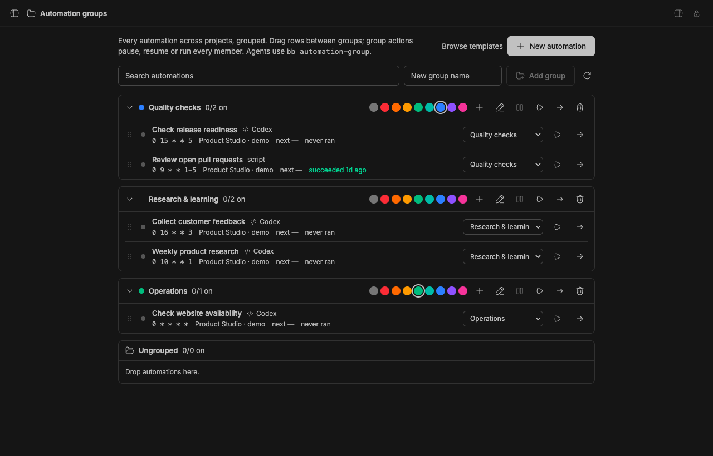
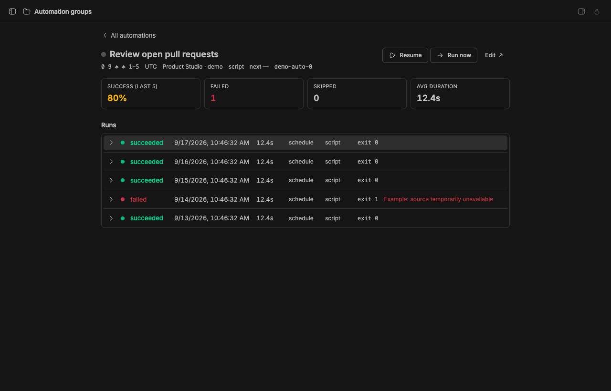

# Autopilots

[](package.json)
[](https://getbb.app)
[](LICENSE)

Organize scheduled work into named folders. See what belongs together, control a whole group, and inspect a run when something needs attention.

[Quick start](#quick-start) · [Install](#install) · [Requirements](#requirements) · [All plugins](../../README.md)



*Screenshots use illustrative schedules and run records in an isolated demo. They are not live automations.*

## What you can do

| | |
| --- | --- |
| **Work in groups** | Create colored folders, search across projects, and move automations between groups. |
| **Control the whole group** | Pause, resume or run group members together. Keep each automation’s schedule in BB Automations. |
| **Understand each run** | Open execution history, errors and outputs. Agent runs can show their conversation in the detail view. |

## Quick start

1. Open **Automation groups** in the sidebar.
2. Create a folder such as Quality checks or Research.
3. Assign existing automations by dragging their rows or choosing a group.
4. Use group controls to pause, resume or run its members.
5. Open a row to inspect that automation’s recent runs.

### Inspect outcomes and run details without losing the automation’s context.



## Install

From a local checkout, install this package:

```sh
bb plugin install ./plugins/automation-groups
```

<details>
<summary>Install a versioned release</summary>

```sh
bb plugin install 'git:https://github.com/dmitriikapustin/bb-plugins-by-kapustin.git@^0.1.0' --plugin automation-groups --tag-prefix automation-groups/
```

Compatible updates remain explicit:

```sh
bb plugin outdated
bb plugin update automation-groups
```

</details>

## Requirements

BB **0.43+** and Plugin SDK **0.4.87+**.

Requires the bundled **Automations** plugin. Scheduled agent runs use your configured providers and their quotas; script runs use their configured execution environment.

This plugin stores group metadata and membership. Automation definitions and schedules remain in BB Automations. A fresh installation creates no schedules.

## From the terminal

```sh
bb automation-group list --json
bb automation-group create "Quality checks" --color blue
bb automation-group assign <automation-id> <group>
bb automation-group runs <automation-id> --limit 10 --json
```

<details>
<summary>Behavior, data and limits</summary>

The detail view reports success and failure counts, consecutive failures, the latest error and average duration over the loaded run window. For agent automations, background mode can reuse a dedicated hidden thread.

Creating a new automation opens the native authoring flow. Removing a group removes its organization metadata rather than deleting its automations. See the [command reference](skills/automation-groups/SKILL.md).

</details>

<details>
<summary>Development</summary>

From the repository root, using Node 22.19+ and the BB CLI:

```sh
node scripts/run.mjs deps automation-groups
node scripts/run.mjs check automation-groups
node scripts/run.mjs test automation-groups
node scripts/run.mjs build automation-groups
```

The test command reports when a package has no declared test suite. To reload a development installation, first confirm that `bb plugin source automation-groups` points to the copy you edited, then run `bb plugin reload automation-groups`.

</details>

---

[All plugins](../../README.md) · [MIT](LICENSE) · **Dmitrii Kapustin**
