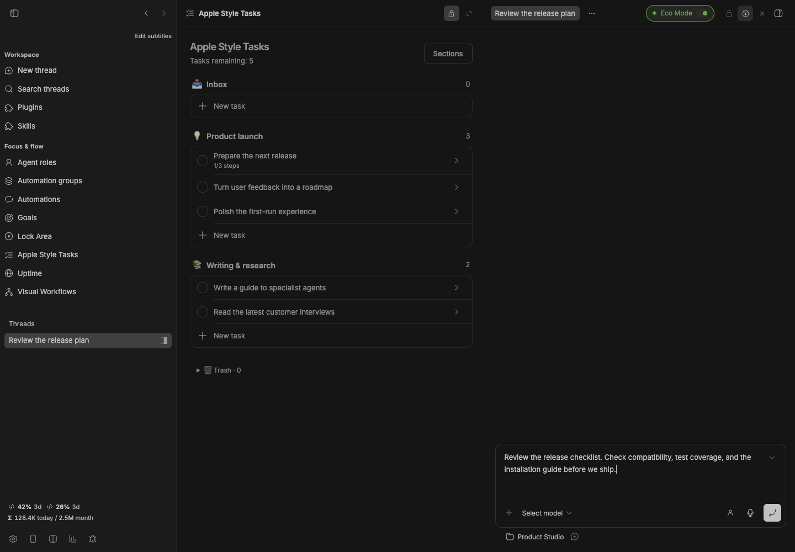

# Fast Archive

[](package.json)
[](https://getbb.app)
[](LICENSE)

Archive a thread from its header with one click. Uses BB’s ordinary archive action, so archived threads remain recoverable.



*Real plugin interface with isolated demonstration data.*

## Install

From the collection root: `bb plugin install ./plugins/fast-archive`.

Requires BB 0.43+ and SDK 0.4.87+. Works on its own. If your BB already shows a native archive button in the same header, Fast Archive hides its duplicate.

## CLI

`bb fast-archive <thread-id>` archives a thread. Restore it through BB’s archived-thread controls. No files or provider sessions are deleted.

## Versioned release

```sh
bb plugin install 'git:https://github.com/dmitriikapustin/bb-plugins-by-kapustin.git@^0.1.0' --plugin fast-archive --tag-prefix fast-archive/
```

MIT · **Dmitrii Kapustin** · [All plugins](../../README.md)
