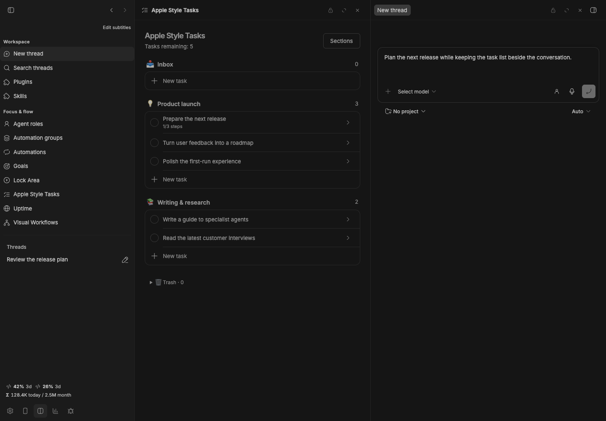

# Fast Split

[](package.json)
[](https://getbb.app)
[](LICENSE)

A single footer icon opens BB's New thread destination in a neighboring pane. Keep the current work visible while you prepare another conversation.



*Real plugin interface with isolated demonstration data.*

## Use it

1. Keep **New thread** visible in sidebar navigation.
2. Click **Fast Split** in the footer.
3. Choose the project and provider in the new pane, then write your prompt.

Uses the same native Cmd/Ctrl-click path as BB's New thread action. No thread is started and no provider request is made until you submit a prompt. Works with BB navigation and Sidebar Subtitles.

Splits require a wide layout with splitting enabled in BB. At the pane cap, close an unlocked pane first. If a custom navigation provider hides the New thread action or removes its native modifier behavior, restore the standard navigation or use Sidebar Subtitles.

    bb plugin install ./plugins/fast-split
    npm run check
    npm run build

BB 0.43+ · Plugin SDK 0.4.87+ · [All plugins](../../README.md)

## Versioned release

```sh
bb plugin install 'git:https://github.com/dmitriikapustin/bb-plugins-by-kapustin.git@^0.1.0' --plugin fast-split --tag-prefix fast-split/
```

MIT · **Dmitrii Kapustin** · [All plugins](../../README.md)
