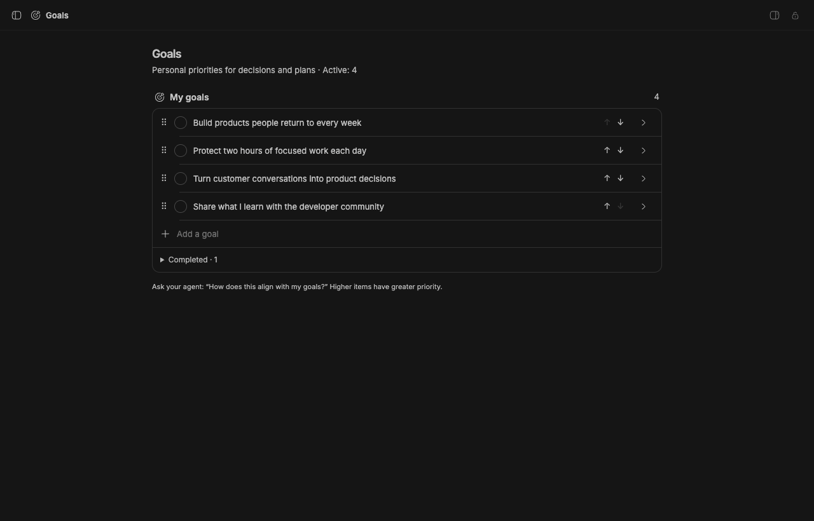
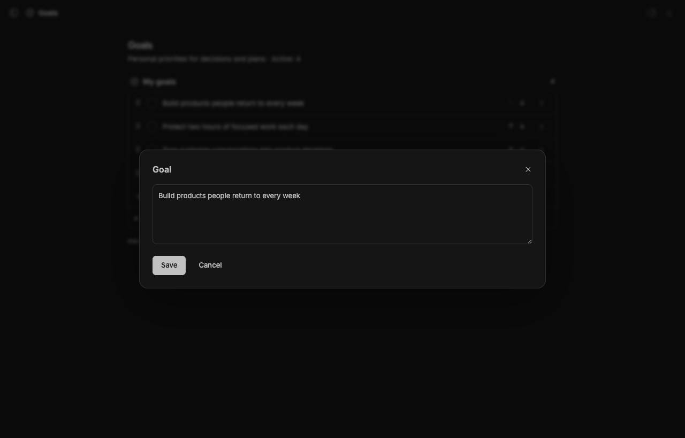

# Goals

[](package.json)
[](https://getbb.app)
[](LICENSE)

Give your decisions a point of reference. Keep an ordered list of personal goals and ask your agent to evaluate a plan against what matters to you.

[Quick start](#quick-start) · [Install](#install) · [Requirements](#requirements) · [All plugins](../../README.md)



*Real plugin interface captured in an isolated BB instance with example content.*

## What you can do

| | |
| --- | --- |
| **One ordered list** | Keep priorities together across projects. Drag goals into order, or move them with the arrow controls. |
| **Ask for a better decision** | When you ask about alignment, your agent reads the current goals and explains the fit and tradeoffs. |
| **Stay in control** | Edit inline through a focused dialog. Completed goals stay separate and are excluded from the active list agents read. |

## Quick start

1. Open **Goals** and add a few priorities in your own words.
2. Put the most important goal at the top.
3. In a thread, ask: **“How does this plan align with my goals?”**
4. Refine your plan using the agent’s comparison.

### Give a goal enough context to guide a decision.



## Install

From a local checkout, install this package:

```sh
bb plugin install ./plugins/goals
```

<details>
<summary>Install a versioned release</summary>

```sh
bb plugin install 'git:https://github.com/dmitriikapustin/bb-plugins-by-kapustin.git@^0.1.0' --plugin goals --tag-prefix goals/
```

Compatible updates remain explicit:

```sh
bb plugin outdated
bb plugin update goals
```

</details>

## Requirements

BB **0.43+** and Plugin SDK **0.4.87+**.

The list works locally in BB, starts empty, and requires no additional account. Asking an agent to evaluate your goals uses that agent’s configured provider.

Goals are consulted when you ask for alignment. They are not an automatic task queue and editing them does not start agent work. Updated agent instructions take effect when the provider session next starts.

## From the terminal

```sh
bb goals show
```

<details>
<summary>Behavior, data and limits</summary>

Store up to 30 goals with 800 characters each. Changes save automatically with revision checks. If another tab changes the list, refresh it before saving instead of overwriting the newer version.

Completed goals remain visible in a separate section. Existing legacy goal text is migrated into cards; the active list is shared across projects. See the [agent instructions](skills/goals/SKILL.md).

</details>

<details>
<summary>Development</summary>

From the repository root, using Node 22.19+ and the BB CLI:

```sh
node scripts/run.mjs deps goals
node scripts/run.mjs check goals
node scripts/run.mjs test goals
node scripts/run.mjs build goals
```

The test command reports when a package has no declared test suite. To reload a development installation, first confirm that `bb plugin source goals` points to the copy you edited, then run `bb plugin reload goals`.

</details>

---

[All plugins](../../README.md) · [MIT](LICENSE) · **Dmitrii Kapustin**
