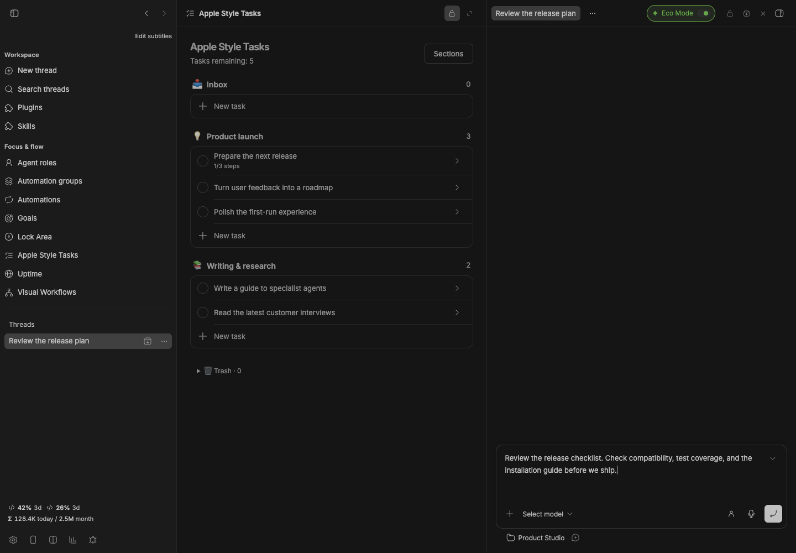
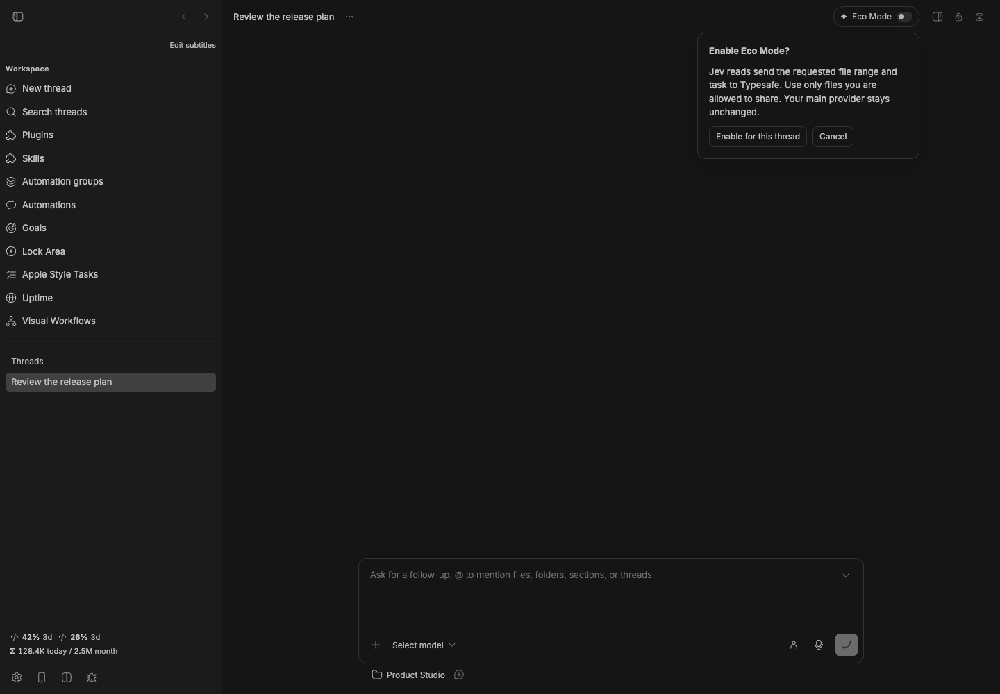

# Jev x bb

[](package.json)
[](https://getbb.app)
[](LICENSE)

Eco Mode asks Typesafe's Jev to select relevant source chunks before they enter your agent's context. The result contains original text, line numbers and an explicit list of omitted ranges. Your chosen BB provider stays in place.



*Real plugin interface with isolated demonstration data.*

## Quick start

1. Install the plugin and add your own Typesafe API key in its BB settings.
2. Open a thread and turn on **Eco Mode** in its header.
3. Review the disclosure: requested file ranges and your task are sent to Typesafe.
4. Ask your agent to explore a non-sensitive source file with `jev_read` or the CLI below.

```sh
bb jev read src/client.ts --task "Find the connection retry logic" --start 1 --end 400
bb jev status
bb jev off
```

## How selection works

The plugin splits a requested range into 20-line chunks. Jev scores their relevance; only strong negative matches below 0.15 are omitted. Uncertain matches and chunks containing common error or constraint markers stay. AGENTS.md, CLAUDE.md and SKILL.md ranges are returned intact. Invalid responses, timeouts and service errors fall back to the original range.

Read omitted lines using normal tools before editing or making claims that something is absent. Selection is an aid to exploration, not proof of completeness.

## Compatibility and costs

Uses BB's native tools and CLI, independent of the main provider. Native tool availability follows each provider's BB integration; the CLI is the fallback. Session instructions apply when BB next constructs the provider session. The runtime toggle gates every Jev read immediately.

This plugin does not compact or rewrite private provider history, intercept other tools, or guarantee faster responses. Jev adds a request and its own API cost. Status reports source character counts, **not token savings or billing**. Savings depend on the task and files.

## Privacy

Off by default, per thread. Your key is a BB secret setting, never returned to the frontend. Requests use only the fixed official Typesafe endpoint and reject redirects. No telemetry or source text is stored by this plugin; only aggregate character counts remain in its local data.

Credential filenames and common token patterns are blocked as a precaution. Detection cannot identify every secret or personal detail. Use only files you are permitted to send to Typesafe. No private key is bundled with this repository.

Reads stay inside the thread's workspace on its own host, including remote hosts. Limit: one UTF-8 file below 1 MB, up to 600 lines and 60,000 characters per read.

## Install and develop

```sh
bb plugin install ./plugins/jev-bb
npm run check
npm test
npm run build
```

BB 0.43+ · Plugin SDK 0.4.87+ · A Typesafe account is required.

[Typesafe quick start](https://docs.typesafe.ai/introduction/quickstart) · [Jev decisions](https://docs.typesafe.ai/primitives/noul) · [All plugins](../../README.md)

Independent community integration; not affiliated with Typesafe.

## Versioned release

```sh
bb plugin install 'git:https://github.com/dmitriikapustin/bb-plugins-by-kapustin.git@^0.1.0' --plugin jev-bb --tag-prefix jev-bb/
```

MIT · **Dmitrii Kapustin** · [All plugins](../../README.md)

## Review what Eco Mode shares before enabling it


