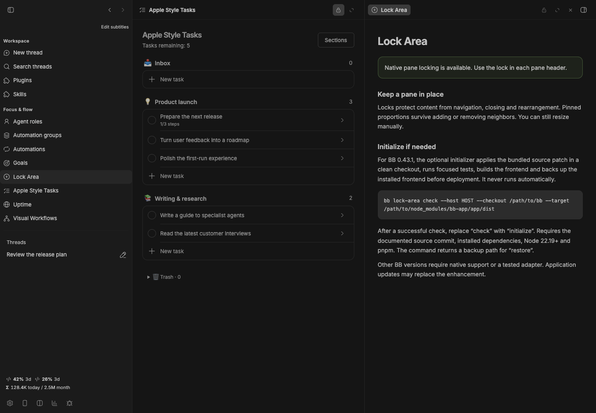

# Lock Area

[](package.json)
[](https://getbb.app)
[](LICENSE)

Use a lock in each pane header to protect its content from accidental closing, replacement or rearrangement. Pinned proportions survive adding or removing neighbors; manual resizing remains available.



*Real plugin interface with isolated demonstration data.*

## Native first

On BB installations that already provide compatible pane locking, use the existing header locks. This plugin does not add duplicate controls or change your stored layout. The Lock Area page detects visible native controls and explains setup.

## Initialize the enhancement

Stock BB versions without this native feature need a frontend enhancement. The included initializer currently supports **BB 0.43.1**, built from source commit **00d1b88c205845015c9fef588aab375452ba38e3**.

1. Prepare a separate, clean checkout of the official BB source at that commit.
2. Install its dependencies using the repository's instructions. Node 22.19+ and pnpm must be on the selected host's PATH.
3. Find the existing installation's node_modules/bb-app/app/dist directory.
4. Run the compatibility check with explicit paths and host.

    bb lock-area check --host HOST_ID --checkout /path/to/bb --target /path/to/node_modules/bb-app/app/dist

After checking the result, use the same arguments with **initialize**. This applies the bundled patch to the clean source checkout, runs the focused lock tests and app build/typecheck, saves the installed frontend, and deploys the new build. It does not restart BB or its agents. Refresh the interface to load it.

The initializer refuses other source revisions, dirty checkouts, unsupported app versions and an installation changed during the build. It runs on the host you name, not implicitly on the BB server. It never runs just because you installed the plugin.

## Restore

Initialization returns the absolute backup path. To restore it:

    bb lock-area restore --host HOST_ID --checkout /path/to/bb --target /path/to/node_modules/bb-app/app/dist --backup /path/to/backup

Restore refuses to overwrite an installation whose entry page changed after initialization. A BB update can replace the enhancement. Disabling the plugin alone does not revert a native frontend enhancement; use restore.

The patch adds locking behavior and its SDK contract. It preserves unrelated plugin IDs, settings and data. Use the source patch with BB's MIT license and attribution retained.

## Limits

Wide split layouts only. Archiving or deleting a thread can still remove its pane. Locking is a layout convenience, not an access-control or security boundary. At the pane limit, unlock or close a pane before opening more work.

A custom native implementation may expose different behavior. The bundled initializer is limited to the tested source version; it does not patch arbitrary app bundles.

    bb plugin install ./plugins/lock-area
    npm run check
    npm test
    npm run build

[All plugins](../../README.md) · [BB source](https://github.com/get-bb/bb)

## Versioned release

```sh
bb plugin install 'git:https://github.com/dmitriikapustin/bb-plugins-by-kapustin.git@^0.1.0' --plugin lock-area --tag-prefix lock-area/
```

MIT · **Dmitrii Kapustin** · [All plugins](../../README.md)
