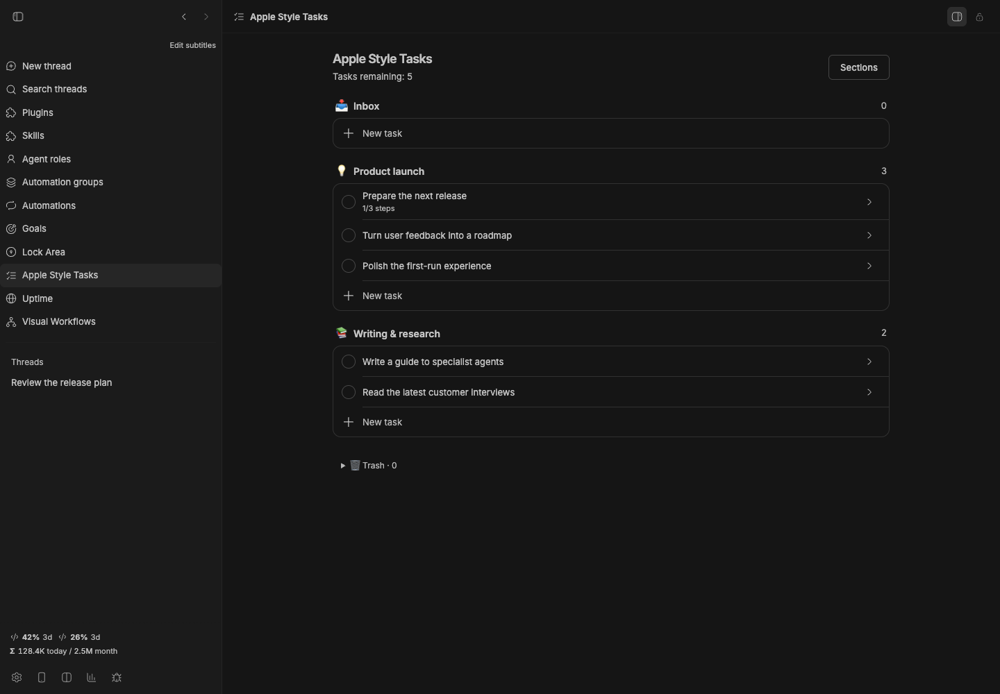
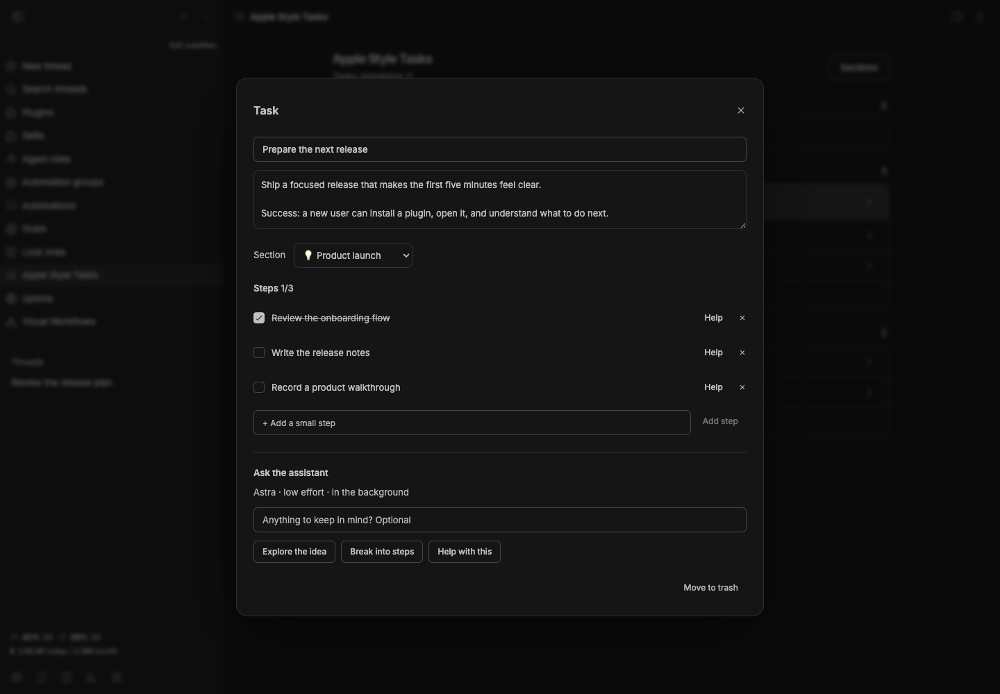

# Apple Style Tasks

[](package.json)
[](https://getbb.app)
[](LICENSE)

Turn an idea into a personal plan. Keep tasks, context and small steps together, and ask an assistant for help when you need it.

[Quick start](#quick-start) · [Install](#install) · [Requirements](#requirements) · [All plugins](../../README.md)



*Real plugin interface captured in an isolated BB instance with example content.*

## What you can do

| | |
| --- | --- |
| **A list that stays yours** | Organize work into named sections, keep notes beside each task, and recover items from the trash. |
| **Make progress in small steps** | Break work into steps and nested subtasks. Completed items stay out of your active list. |
| **Assistance on your terms** | Explore an idea, request a breakdown, or ask for a useful result. Choose which suggestions become part of your plan. |

## Quick start

1. Open **Apple Style Tasks** in the sidebar.
2. Use **Sections** to create a space such as Product launch or Writing.
3. Add a task and open it to write notes or add steps.
4. Choose **Explore the idea**, **Break into steps**, or **Help with this** when you want assistance.
5. Review the result and accept only the suggestions you want.

### Keep the context, steps and assistant controls together.



## Install

From a local checkout, install this package:

```sh
bb plugin install ./plugins/my-tasks
```

<details>
<summary>Install a versioned release</summary>

```sh
bb plugin install 'git:https://github.com/dmitriikapustin/bb-plugins-by-kapustin.git@^0.3.0' --plugin my-tasks --tag-prefix my-tasks/
```

Compatible updates remain explicit:

```sh
bb plugin outdated
bb plugin update my-tasks
```

</details>

The plugin keeps the existing `my-tasks` ID, so renaming does not reset your checklist. Apple Style Tasks is an independent community plugin and is not affiliated with Apple.

## Requirements

BB **0.43+** and Plugin SDK **0.4.87+**.

The checklist works locally in BB. Optional assistance requires an authenticated Codex CLI on a connected host and currently uses **gpt-6-astra** with low reasoning effort. It consumes the provider account’s quota.

Task context is sent to Codex only when assistance is requested. The background worker is read-only, returns text, and does not make external changes. Work can continue after the dialog closes; you can stop it from the task. Each run has a ten-minute timeout. An interrupted active run shows an error rather than silently starting again.

## From the terminal

```sh
bb my-tasks list
bb my-tasks get <task-id>
bb my-tasks add "Prepare the next release"
```

<details>
<summary>Behavior, data and limits</summary>

Tasks and saved results live in the plugin database. A task supports up to 200 steps; the built-in assistant can return up to 30 suggestions in one run. Deleting a task or step cancels its associated work. Sections support custom names and a fixed set of icons; deleting a section moves its tasks to the Inbox.

There are no due dates or calendar views. The CLI lists the latest 100 tasks. See the [agent command reference](skills/my-tasks/SKILL.md) for proposing steps without marking a task complete.

</details>

<details>
<summary>Development</summary>

From the repository root, using Node 22.19+ and the BB CLI:

```sh
node scripts/run.mjs deps my-tasks
node scripts/run.mjs check my-tasks
node scripts/run.mjs test my-tasks
node scripts/run.mjs build my-tasks
```

The test command reports when a package has no declared test suite. To reload a development installation, first confirm that `bb plugin source my-tasks` points to the copy you edited, then run `bb plugin reload my-tasks`.

</details>

---

[All plugins](../../README.md) · [MIT](LICENSE) · **Dmitrii Kapustin**
