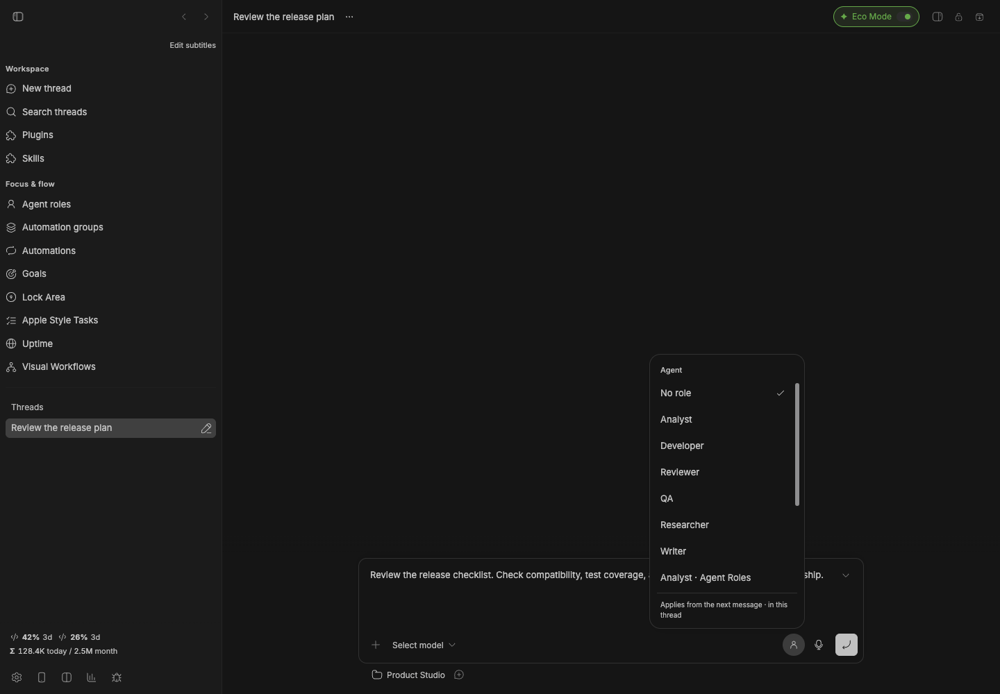
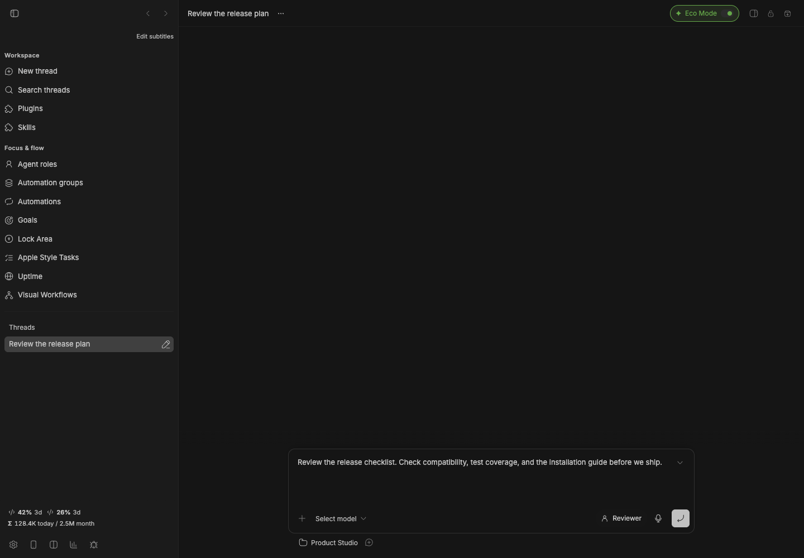

# Role Picker

[](package.json)
[](https://getbb.app)
[](LICENSE)

Choose a role beside the composer and send your message normally. Bring specialist instructions into the thread you are already working in.

[Quick start](#quick-start) · [Install](#install) · [Requirements](#requirements) · [All plugins](../../README.md)



*Real plugin interface captured in an isolated BB instance with example content.*

## What you can do

| | |
| --- | --- |
| **Choose as you write** | Choose one of six included specialists, or a role from Agent Roles when it is installed. |
| **Keep the conversation** | The role applies from the next message in an existing thread, or from the first message in a new one. |
| **Keep your setup** | Your selected model, provider, permissions, environment, attachments and mentions remain in effect. |

## Quick start

1. Install Role Picker. It includes Analyst, Developer, Reviewer, QA, Researcher and Writer.
2. Open a thread or start composing a new one.
3. Click the role button beside the microphone and choose a specialist.
4. Send normally. Choose **No role** to remove the specialist persona on the next send.

### A selected role stays beside the message you are preparing.



## Install

From a local checkout, install this package:

```sh
bb plugin install ./plugins/role-picker
```

Optionally install `./plugins/agent-roles` to select your custom roles alongside the included specialists.

<details>
<summary>Install a versioned release</summary>

```sh
bb plugin install 'git:https://github.com/dmitriikapustin/bb-plugins-by-kapustin.git@^0.1.0' --plugin role-picker --tag-prefix role-picker/
```

Compatible updates remain explicit:

```sh
bb plugin outdated
bb plugin update role-picker
```

</details>

## Requirements

BB **0.43+** and Plugin SDK **0.4.87+**.

Works independently. The optional **Agent Roles** companion adds custom specialists; it is not required. Each provider uses your existing account and quota.

The current implementation uses a scoped content script around BB’s message submission routes because SDK 0.4.87 has no submit middleware. Recheck compatibility after BB updates. Composer actions are hidden in compact mode.

<details>
<summary>Behavior, data and limits</summary>

If a selected role has been deleted or cannot be prepared, sending is blocked and the draft is restored. The saved selection is stored in Role Picker thread metadata. When Agent Roles is enabled, its metadata is also updated for compatibility. Imported roles have separate identities from built-in roles; disabling their source never silently substitutes another persona. A selection not yet sent belongs to that composer and resets when the plugin reloads.

The role supplies instructions; its default model does not override the model you chose in the composer. See the [agent reference](skills/role-picker/SKILL.md).

</details>

<details>
<summary>Development</summary>

From the repository root, using Node 22.19+ and the BB CLI:

```sh
node scripts/run.mjs deps role-picker
node scripts/run.mjs check role-picker
node scripts/run.mjs test role-picker
node scripts/run.mjs build role-picker
```

The test command reports when a package has no declared test suite. To reload a development installation, first confirm that `bb plugin source role-picker` points to the copy you edited, then run `bb plugin reload role-picker`.

</details>

---

[All plugins](../../README.md) · [MIT](LICENSE) · **Dmitrii Kapustin**
