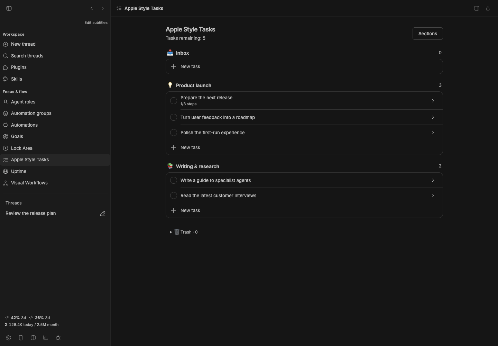
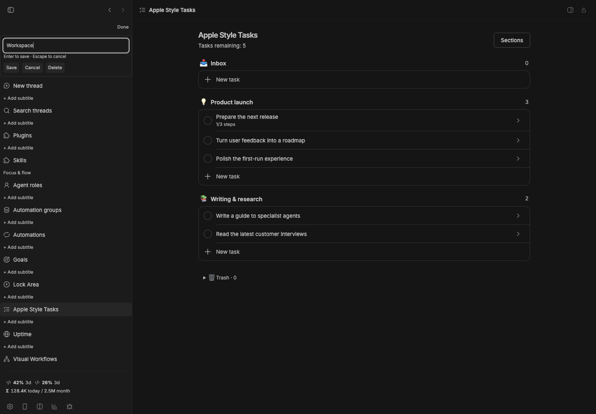

# Sidebar Subtitles

[](package.json)
[](https://getbb.app)
[](LICENSE)

Organize BB navigation with small section headings. Edit in place with explicit Save, Cancel and Delete controls. Escape cancels a draft; moving focus never saves it accidentally.



*Real plugin interface with isolated demonstration data.*

## Quick start

1. Install the plugin.
2. Select **Sidebar Subtitles** as the navigation provider in **Settings → Appearance** if another provider is already selected.
3. Click **Edit subtitles**, choose a destination and add the heading that should appear above it.
4. Save, then click **Done**.

Navigation still uses BB's native activation and split-drag actions. Cmd/Ctrl-click opens a destination in a split. Compact layouts are supported.

Headings share the existing native subtitle preference encoding. Existing headings survive. The plugin renders navigation once, so headings are not duplicated. Disabling it restores BB's navigation; stored headings remain for later use.

## Editing safely

Names support up to 120 characters. Empty saves remove a heading. Writes preserve destination order and unrelated headings. Concurrent preference edits are rejected instead of overwritten; the draft stays available to retry.

Only one navigation provider is active at a time. This plugin keeps BB's supplied destination order, visibility and activation; use native Appearance controls to change those.

    bb plugin install ./plugins/sidebar-subtitles
    npm run check
    npm test
    npm run build

BB 0.43+ · Plugin SDK 0.4.87+ · [All plugins](../../README.md)

## Versioned release

```sh
bb plugin install 'git:https://github.com/dmitriikapustin/bb-plugins-by-kapustin.git@^0.1.0' --plugin sidebar-subtitles --tag-prefix sidebar-subtitles/
```

MIT · **Dmitrii Kapustin** · [All plugins](../../README.md)

## Edit a heading without saving on blur


