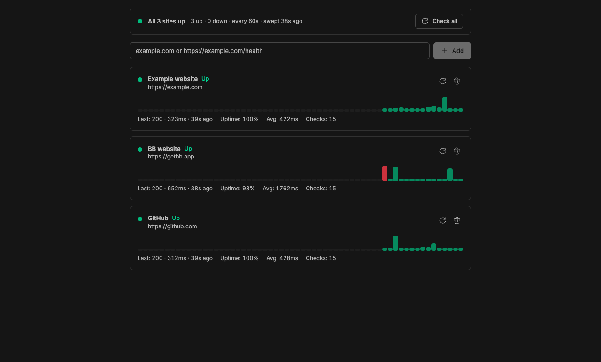

# Uptime

[](package.json)
[](https://getbb.app)
[](LICENSE)

Keep website availability beside your work. Add the sites you care about and see their latest status, response times and recent checks inside BB.

[Quick start](#quick-start) · [Install](#install) · [Requirements](#requirements) · [All plugins](../../README.md)



*Captured in an isolated demo monitoring public example websites. Availability and latency reflect that capture, not a service guarantee.*

## What you can do

| | |
| --- | --- |
| **A view of your sites** | Scan availability, average latency, uptime percentage and the latest error on each site card. |
| **A history at a glance** | See the most recent 60 checks as a compact history of response times. |
| **Status beyond the page** | The sidebar indicates when a site is down. Use the CLI for an on-demand check or structured output. |

## Quick start

1. Open **Uptime** and enter a website or health-check URL.
2. Add a name that helps you recognize it.
3. Let the background monitor collect checks, or choose **Check all**.
4. Open the page when the sidebar signals a problem.

## Install

From a local checkout, install this package:

```sh
bb plugin install ./plugins/uptime
```

<details>
<summary>Install a versioned release</summary>

```sh
bb plugin install 'git:https://github.com/dmitriikapustin/bb-plugins-by-kapustin.git@^0.1.0' --plugin uptime --tag-prefix uptime/
```

Compatible updates remain explicit:

```sh
bb plugin outdated
bb plugin update uptime
```

</details>

## Requirements

BB **0.43+** and Plugin SDK **0.4.87+**.

The BB server must be running and able to reach the websites. No external monitoring account is required.

Checks send HTTP GET requests, follow redirects and treat a final 2xx or 3xx response as available. The default interval is 60 seconds and the timeout is 10 seconds. This is monitoring from the BB server’s location, not a distributed monitoring service.

## From the terminal

```sh
bb uptime list --json
bb uptime add https://example.com
bb uptime check --json
bb plugin config uptime
```

<details>
<summary>Behavior, data and limits</summary>

The plugin starts with no sites. Site addresses and check history stay in plugin storage. The `intervalSeconds` setting has a minimum of 10 seconds; `timeoutMs` controls how long a request may wait.

`bb uptime check` exits with code 2 if any site is down. Recent history is limited to 60 checks per site. See the [agent and CLI reference](skills/uptime/SKILL.md).

</details>

<details>
<summary>Development</summary>

From the repository root, using Node 22.19+ and the BB CLI:

```sh
node scripts/run.mjs deps uptime
node scripts/run.mjs check uptime
node scripts/run.mjs test uptime
node scripts/run.mjs build uptime
```

The test command reports when a package has no declared test suite. To reload a development installation, first confirm that `bb plugin source uptime` points to the copy you edited, then run `bb plugin reload uptime`.

</details>

---

[All plugins](../../README.md) · [MIT](LICENSE) · **Dmitrii Kapustin**
