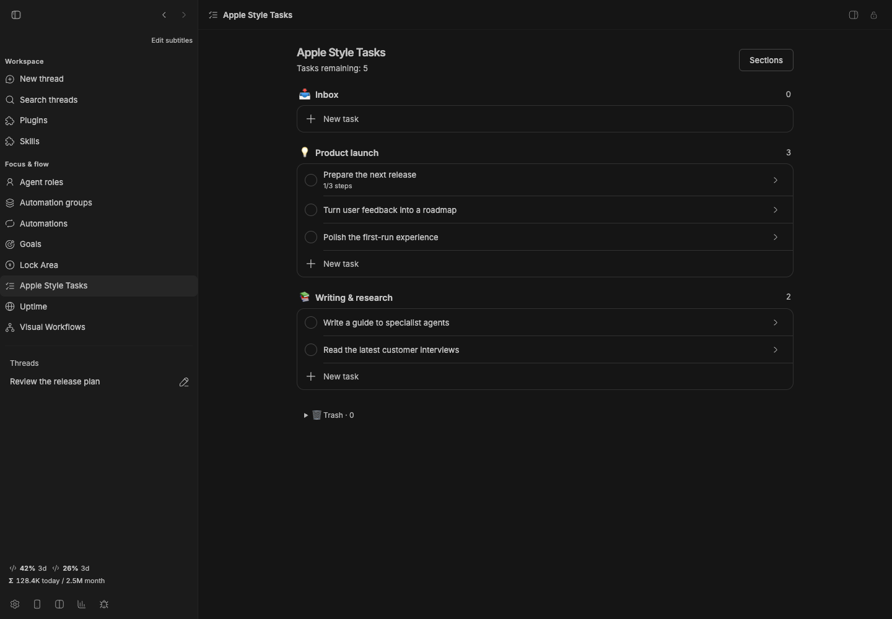
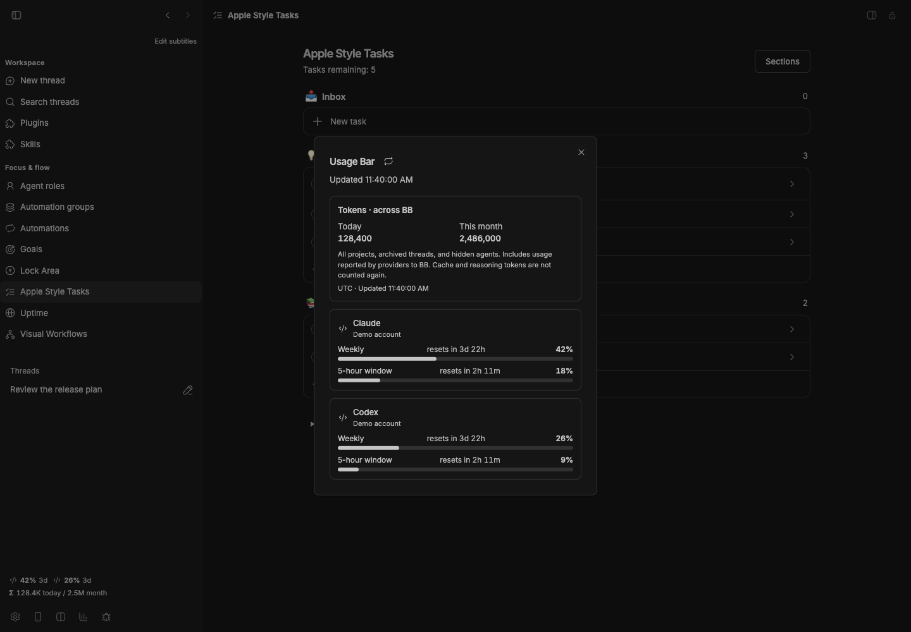

# Usage Bar

[](package.json)
[](https://getbb.app)
[](LICENSE)

Keep provider quotas and reset times within reach. Open the details for a broader view of usage windows and recorded token totals across BB.

[Quick start](#quick-start) · [Install](#install) · [Requirements](#requirements) · [All plugins](../../README.md)



*The screenshot shows illustrative provider quotas and token totals in an isolated demo. It contains no personal account data.*

## What you can do

| | |
| --- | --- |
| **Always within reach** | The sidebar shows weekly usage and time until reset for reporting provider accounts. |
| **Look across windows and hosts** | Open the details for available quota windows, account status and connected-host information. |
| **Understand recorded usage** | View tokens for today and the current month, including archived threads and hidden agents reported to BB. |

## Quick start

1. Configure your provider accounts through BB as usual.
2. Read the usage chips above the sidebar footer.
3. Click the bar to open the detailed view.
4. Refresh when you need the latest provider snapshot.

## Install

From a local checkout, install this package:

```sh
bb plugin install ./plugins/usage-bar
```

<details>
<summary>Install a versioned release</summary>

```sh
bb plugin install 'git:https://github.com/dmitriikapustin/bb-plugins-by-kapustin.git@^0.1.0' --plugin usage-bar --tag-prefix usage-bar/
```

Compatible updates remain explicit:

```sh
bb plugin outdated
bb plugin update usage-bar
```

</details>

Works independently. The optional Usage Limits plugin adds a separate footer shortcut; it is not required for the bar or its details dialog.

## Requirements

BB **0.43+** and Plugin SDK **0.4.87+**.

Uses BB’s provider integrations and their existing authentication. A provider and connected host must report quota information for their limits to appear; no extra credentials are required by this plugin.

Token totals include only usage providers recorded in BB. History permanently deleted before the first collection cannot be reconstructed. These counters are not billing statements.

## From the terminal

```sh
bb usage-bar
bb usage-bar --all --force
bb usage-bar --json
bb usage-bar --tokens
```

<details>
<summary>Behavior, data and limits</summary>

Provider snapshots are cached for five minutes by default, with a shorter refresh interval after a thread finishes. Adjust `cacheMinutes` in plugin settings.

Token totals use the browser timezone in the interface and the server timezone in the CLI. The collector includes visible, hidden and archived threads, and avoids counting replayed cumulative snapshots twice. Cache and reasoning tokens are not added again to provider totals. See the [usage reference](skills/usage-bar/SKILL.md).

</details>

<details>
<summary>Development</summary>

From the repository root, using Node 22.19+ and the BB CLI:

```sh
node scripts/run.mjs deps usage-bar
node scripts/run.mjs check usage-bar
node scripts/run.mjs test usage-bar
node scripts/run.mjs build usage-bar
```

The test command reports when a package has no declared test suite. To reload a development installation, first confirm that `bb plugin source usage-bar` points to the copy you edited, then run `bb plugin reload usage-bar`.

</details>

---

[All plugins](../../README.md) · [MIT](LICENSE) · **Dmitrii Kapustin**

## Inspect quota windows and recorded totals


