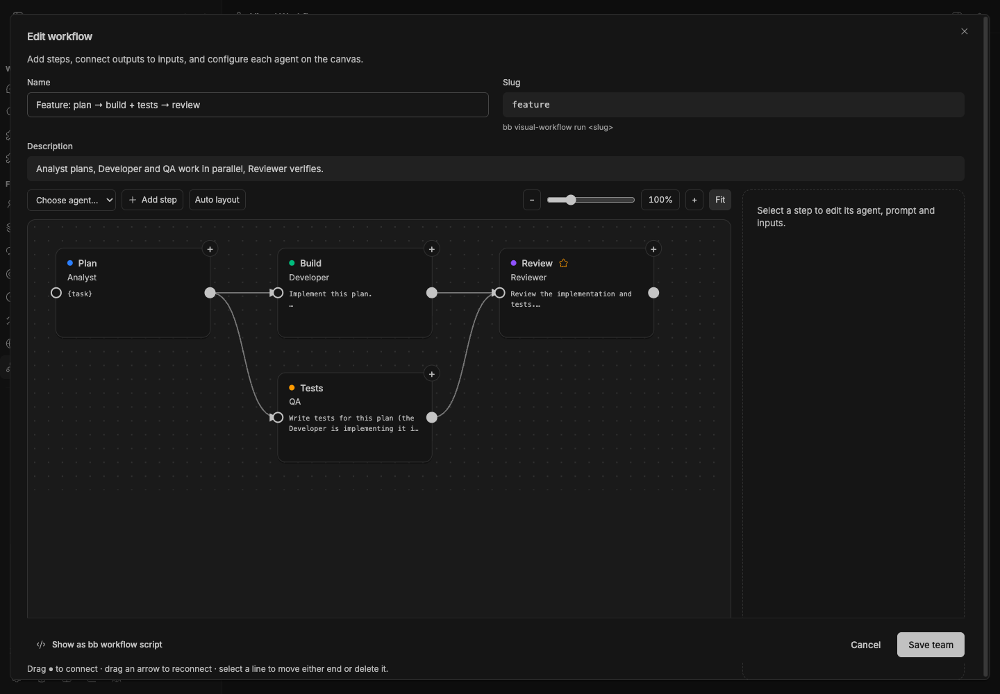
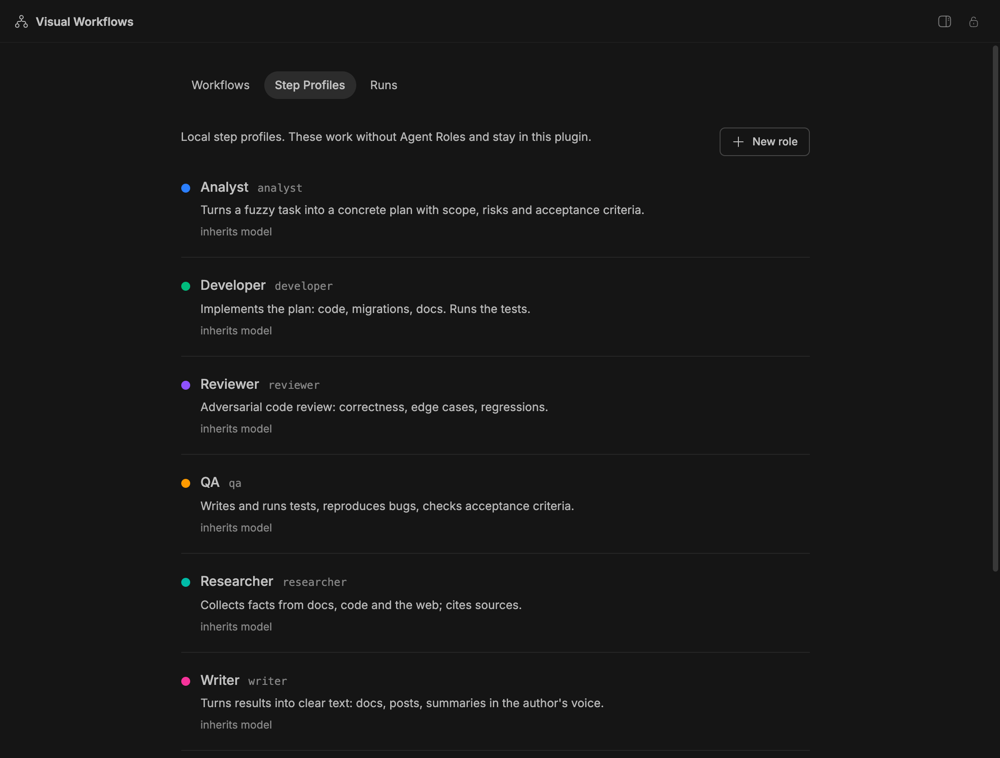

# Visual Workflows

[](package.json)
[](https://getbb.app)
[](LICENSE)

Connect specialist steps on a canvas, run them with your configured BB providers, and inspect every handoff. Includes independent step profiles and example graphs; Agent Roles is optional.



*Real plugin interface with isolated demonstration data.*

## Quick start

1. Open **Visual Workflows** and review the included workflows.
2. Edit a graph, choose each step profile, and connect outputs to inputs.
3. Review provider and permission preferences under **Step profiles**.
4. Run a concrete task and inspect its steps under **Runs**.

## Optional companions

**Import / refresh Agent Roles** copies its profiles and saved legacy workflows into this plugin's database. Refresh deliberately replaces previously imported copies; locally created profiles and workflows remain untouched. Imported copies continue working after Agent Roles is disabled. Existing Agent Roles data and run history are preserved in their original plugin.

Role Picker can configure your initiating thread independently. Workflow workers use their own step profiles.

## Install

```sh
bb plugin install ./plugins/visual-workflows
bb visual-workflow teams
bb visual-workflow run feature --task "Implement the agreed feature" --parent-self
```

Requires BB 0.43+ / Plugin SDK 0.4.87+ and configured providers. Runs consume provider quotas. Independent branches run concurrently; dependent steps receive predecessor outputs. Cycles and missing profiles are rejected. Cancelling stops pending steps and active workers.

## Development

```sh
npm ci
npm run check
npm test
npm run build
```

MIT · [BB Plugins by Kapustin](../../README.md)

## Versioned release

```sh
bb plugin install 'git:https://github.com/dmitriikapustin/bb-plugins-by-kapustin.git@^0.1.0' --plugin visual-workflows --tag-prefix visual-workflows/
```

MIT · **Dmitrii Kapustin** · [All plugins](../../README.md)

## Own your workflow step profiles


